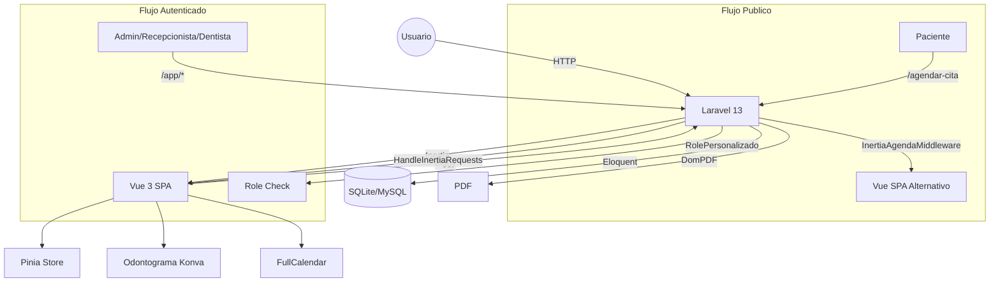

# Codentalv3

Sistema de gestion para clinica dental construido con Laravel 13 + Inertia (Vue 3 + TypeScript). Administra pacientes, citas, odontogramas, presupuestos, facturacion y expediente clinico en una interfaz SPA con roles diferenciados (administrador, recepcionista, dentista).

## Tabla de Contenidos

- [Acerca del Proyecto](#acerca-del-proyecto)
- [Arquitectura y Tecnologias](#arquitectura-y-tecnologias)
- [Inicio Rapido](#inicio-rapido)
- [Comandos Principales](#comandos-principales)
- [Roles del Sistema](#roles-del-sistema)
- [Referencia de Rutas](#referencia-de-rutas)
- [Estructura del Proyecto](#estructura-del-proyecto)
- [Variables de Entorno](#variables-de-entorno)
- [Pruebas](#pruebas)
- [Contribucion](#contribucion)

## Acerca del Proyecto

Codentalv3 digitaliza los procesos operativos de una clinica dental: agenda de citas, historia clinica, odontograma interactivo (diagrama dental basado en Konva), presupuestos con desglose por tratamiento, control de abonos, generacion de PDF (recetas, evoluciones, presupuestos) y modulo de facturacion con restriccion de acceso financiero.

### Funcionalidades Principales

- **Agenda de citas** con calendario (FullCalendar), confirmacion y cancelacion
- **Flujo publico de agendado** para pacientes sin autenticacion (identificacion, registro, seleccion de horario, confirmacion con PDF)
- **Expediente clinico**: historia clinica con antecedentes medicos, odontologicos y habitos
- **Odontograma interactivo**: diagrama dental con hallazgos por diente, cara dental y enfermedad, con seguimiento temporal (evaluacion inicial, seguimiento, alta, reevaluacion)
- **Presupuestos**: catalogo de tratamientos, precios con descuentos, estado por detalle
- **Facturacion y caja**: registro de abonos, distribucion por detalle de presupuesto, anulaciones, estado de cuenta por paciente
- **Evolucion clinica y recetas**: registro por cita, descarga PDF
- **Control de usuarios**: CRUD de usuarios del sistema con roles (admin, recepcionista, dentista)
- **PDF generation** via DomPDF para confirmacion de citas, recetas, evoluciones y presupuestos

## Arquitectura y Tecnologias

### Stack

| Capa | Tecnologia |
|------|-----------|
| Backend | Laravel 13 (PHP 8.3+) |
| Frontend | Vue 3 + TypeScript + Inertia.js v3 |
| UI Framework | Tailwind CSS v4 + daisyUI v5 |
| State | Pinia |
| Calendar | FullCalendar v7 |
| Odontograma | Konva.js + vue-konva |
| Routing (client) | Ziggy (Type-safe Laravel routes en JS) |
| PDF | DomPDF (barryvdh/laravel-dompdf) |
| Database | SQLite (default), MySQL compatible via config |
| Build | Vite 8 + laravel-vite-plugin + @inertiajs/vite |
| Testing | PHPUnit 12 + SQLite :memory: |

### Diagrama de Arquitectura



### Decisiones Tecnicas

- **Inertia.js v3** como glue layer entre Laravel y Vue 3, sin API REST separada. Las rutas se definen exclusivamente en `routes/web.php` y se consumen via Ziggy desde el frontend.
- **Dos entrypoints de Vite**: `resources/js/app.ts` (SPA principal con Pinia, toast, Konva) y `resources/js/main.ts` (para flujo publico no-Inertia). Configurados en `vite.config.ts` como inputs del plugin Laravel.
- **Dos layouts de Inertia**: `app-inertia` (autenticado, con sidebar y header) y `agendar-cita-inertia` (flujo publico), intercambiados via middleware `HandleInertiaRequests` e `InertiaAgendaMiddleware`.
- **El dominio del negocio esta en espanol**: modelos (Paciente, Cita, Odontograma, Presupuesto), rutas, controladores y migraciones usan nomenclatura en espanol consistente.

## Inicio Rapido

### Prerrequisitos

- PHP 8.3+
- Composer 2.x
- Node.js 22+ y npm
- SQLite (extension `pdo_sqlite` habilitada en PHP)

### Instalacion

```bash
composer run setup
```

Este comando ejecuta en secuencia:

1. `composer install` -- dependencias PHP
2. Copia `.env.example` a `.env` si no existe
3. `php artisan key:generate` -- genera APP_KEY
4. `php artisan migrate --force` -- ejecuta migraciones en SQLite
5. `npm install --ignore-scripts` -- dependencias JS
6. `npm run build` -- compila assets de Vite

### Iniciar Servidores de Desarrollo

```bash
composer run dev
```

Ejecuta concurrentemente `php artisan serve` y `npm run dev` (Vite HMR). La aplicacion queda disponible en `http://localhost:8000`.

El servidor de Vite corre en `http://localhost:5173` y hace hot-reload del frontend.

## Comandos Principales

| Comando | Descripcion |
|---------|-------------|
| `composer run setup` | Instalacion completa (dependencias, migraciones, build) |
| `composer run dev` | Servidores de desarrollo concurrentes (PHP + Vite) |
| `composer test` | Ejecuta toda la suite de pruebas PHPUnit |
| `php artisan test --filter=NombreTest` | Ejecuta una prueba especifica |
| `php artisan migrate` | Ejecuta migraciones pendientes |
| `php artisan db:seed` | Ejecuta seeders (DienteSeeder, CarasDentalesSeeder, EnfermedadSeeder, etc.) |
| `npm run build` | Compila assets para produccion |
| `php artisan ziggy:generate` | Regenera definiciones TypeScript de rutas |

## Roles del Sistema

Tres roles definidos en `UserRolEnum`:

| Role | Clave | Acceso |
|------|-------|--------|
| Administrador | `admin` | Acceso completo: usuarios, configuracion, finanzas, pacientes |
| Recepcionista | `recep` | Dashboard de recepcion, agenda, pacientes, facturacion (solo lectura financiera) |
| Dentista | `dent` | Agenda personal, evolucion clinica, odontograma, recetas. Sin acceso a facturacion ni administracion de usuarios |

El middleware `role.personalizado` (`RolePersonalizado.php`) valida el acceso en las rutas protegidas. El middleware `CheckFinancialAccess` restringe escritura en modulo de caja para dentistas.

## Referencia de Rutas

### Publicas (sin autenticacion)

| Metodo | URI | Nombre |
|--------|-----|--------|
| GET | `/` | `index` |
| GET/POST | `/login` | `login.show` / `login` |
| GET | `/logout` | `logout` |
| GET | `/agendar-cita` | `agendar-cita` |
| GET/POST | `/agendar-cita/identificar-paciente` | `agendar-cita.identificar-paciente` |
| GET/POST | `/agendar-cita/registrar-paciente` | `agendar-cita.paciente-nuevo.show` / `agendar-cita.registrar-paciente` |
| GET/POST | `/agendar-cita/calendario` | `agendar-cita.calendario.show` / `agendar-cita.calendario.store` |
| GET | `/agendar-cita/confirmacion/{cita}` | `agendar-cita.confirmacion` |
| GET | `/agendar-cita/confirmacion/{cita}/pdf` | `agendar-cita.descargar-pdf` |

### Autenticadas (prefix `/app`)

#### Agenda
| Metodo | URI | Nombre |
|--------|-----|--------|
| GET | `/app/agenda` | `agenda` |
| POST | `/app/agenda/citas` | `agenda.citas.store` |
| GET/PATCH | `/app/agenda/cita/{cita}/confirmar` | `agenda.citas.confirmar` |
| PATCH | `/app/agenda/cita/{cita}/cancelar` | `agenda.citas.cancelar` |

#### Evolucion Clinica y Recetas
| Metodo | URI | Nombre |
|--------|-----|--------|
| GET/POST | `/app/citas/{cita}/evolucion` | `evolucion.create` / `evolucion.store` |
| GET | `/app/evoluciones/{evolucion}/pdf` | `evolucion.pdf` |
| GET | `/app/recetas/{receta}/pdf/download` | `recetas.pdf.download` |
| GET | `/app/recetas/{receta}/pdf/stream` | `recetas.pdf.stream` |

#### Dashboard Recepcion (admin + recep)
| Metodo | URI | Nombre |
|--------|-----|--------|
| GET | `/app/recepcion/dashboard` | `recepcion.dashboard` |

#### Pacientes
| Metodo | URI | Nombre |
|--------|-----|--------|
| GET | `/app/pacientes` | `pacientes.index` |
| GET/POST | `/app/pacientes/create` | `pacientes.create` / `pacientes.store` |
| GET/PATCH | `/app/pacientes/edit/{paciente}` | `pacientes.edit` / `pacientes.update` |
| DELETE | `/app/pacientes/delete/{paciente}` | `pacientes.destroy` |
| GET | `/app/pacientes/show/{paciente}` | `pacientes.show` |
| POST | `/app/pacientes/verify/{paciente}` | `pacientes.verify` |
| GET/PATCH | `/app/pacientes/{paciente}/historia-clinica` | `pacientes.historia-clinica.edit` / `update` |
| POST | `/app/pacientes/{paciente}/consulta-express` | `pacientes.consulta-express` |

#### Odontograma
| Metodo | URI | Nombre |
|--------|-----|--------|
| GET | `/app/pacientes/{paciente}/odontograma/inicial` | `pacientes.odontograma.inicial` |
| GET | `/app/pacientes/{paciente}/odontograma/final` | `pacientes.odontograma.final` |
| POST | `/app/pacientes/{paciente}/odontograma` | `pacientes.odontograma.guardar` |

#### Caja / Facturacion (con CheckFinancialAccess)
| Metodo | URI | Nombre |
|--------|-----|--------|
| GET | `/app/caja/facturacion` | `caja.facturacion` |
| GET | `/app/caja/facturacion/buscar-pacientes` | `caja.facturacion.buscar-pacientes` |
| POST | `/app/caja/facturacion/abonos` | `caja.abonos.store` |
| POST | `/app/caja/facturacion/abonos/{movimiento}/anular` | `caja.abonos.anular` |
| GET | `/app/caja/facturacion/estado-cuenta/{pacienteId}` | `caja.estado-cuenta` |

#### Presupuestos
| Metodo | URI | Nombre |
|--------|-----|--------|
| GET | `/app/presupuestos/{presupuesto}/pdf` | `presupuestos.pdf.download` |

#### Administracion (solo admin)
| Metodo | URI | Nombre |
|--------|-----|--------|
| GET | `/app/admin/usuarios` | `usuarios` |
| GET/POST | `/app/admin/usuarios/create` | `usuarios.create` / `usuarios.store` |
| GET/PATCH | `/app/admin/usuarios/edit/{user}` | `usuarios.edit` / `usuarios.update` |
| DELETE | `/app/admin/usuarios/delete/{user}` | `usuarios.destroy` |
| GET | `/app/admin/profile/{user}` | `usuarios.profile` |
| GET/PATCH | `/app/admin/settings/{user}` | `usuarios.settings` |

## Estructura del Proyecto

```
resources/
  js/
    app.ts                    # Entrypoint Inertia (Pinia, Ziggy, Konva, Toast)
    main.ts                   # Entrypoint secundario (flujo publico)
    bootstrap.ts              # Configuracion Axios
    ziggy.d.ts                # Tipos generados de Ziggy
    Pages/                    # Componentes Inertia (12 paginas)
      Agenda/Calendario.vue
      Agenda/ConfirmarCita.vue
      AgendarCita/            # Flujo publico
      Doctor/EvolutionForm.vue
      Facturacion/Index.vue
      Pacientes/Create.vue
      Pacientes/HistoriaClinica/Edit.vue
      Pacientes/Odontograma/Inicial.vue
      Pacientes/Odontograma/Final.vue
      Reception/Dashboard.vue
    components/               # Componentes reutilizables
      AgendarCita/RegistrarPacienteWizard/  # Wizard 5 pasos
      Odontograma/            # Diente.vue, OdontogramaSVG.vue, etc.
      Pacientes/RegistrarPacienteExpedienteWizard/
    stores/                   # Pinia stores
      odontograma.ts
      registrarPacienteWizard.ts
    composables/              # Composables reutilizables
    types/                    # Interfaces TypeScript
  views/
    layouts/
      app-inertia.blade.php   # Layout autenticado (drawer + sidebar + header)
      agendar-cita-inertia.blade.php  # Layout publico
    pdf/                      # Templates PDF (DomPDF)
    app/pacientes/            # Legacy Blade views (en transicion a Inertia)
    agendar-cita/             # Legacy Blade views (flujo publico mixto)

app/
  Http/
    Controllers/              # 18 controladores
    Middleware/
      AuthPersonalizado.php   # Autenticacion personalizada
      RolePersonalizado.php   # Control de roles
      CheckFinancialAccess.php # Restriccion modulo financiero
      HandleInertiaRequests.php # Shared props Inertia
      InertiaAgendaMiddleware.php  # Layout alternativo flujo publico
  Models/                     # 22 modelos (Paciente, Cita, Odontograma, etc.)
  Enums/                      # EstatusCitaEnum, UserRolEnum, SexoEnum, etc.
  Casts/TelephoneCast.php     # Normaliza telefonos a 10 digitos

routes/
  web.php                     # Todas las rutas de la aplicacion

database/
  migrations/                 # 26 migraciones
  seeders/                    # 5 seeders (Dientes, Caras, Enfermedades, etc.)
```

## Variables de Entorno

Las variables principales se definen en `.env`. El archivo `.env.example` contiene la configuracion base:

| Variable | Default | Descripcion |
|----------|---------|-------------|
| `APP_NAME` | `Laravel` | Nombre de la aplicacion |
| `APP_ENV` | `local` | Entorno (`local`, `production`, `testing`) |
| `APP_DEBUG` | `true` | Modo debug |
| `APP_URL` | `http://localhost` | URL base |
| `DB_CONNECTION` | `sqlite` | Driver de BD (`sqlite`, `mysql`) |
| `SESSION_DRIVER` | `database` | Driver de sesion |
| `QUEUE_CONNECTION` | `database` | Driver de cola |
| `CACHE_STORE` | `database` | Driver de cache |

Para usar MySQL, descomentar las variables `DB_HOST`, `DB_PORT`, `DB_DATABASE`, `DB_USERNAME`, `DB_PASSWORD` en `.env` y cambiar `DB_CONNECTION=mysql`.

## Pruebas

La suite de pruebas usa SQLite en memoria (`:memory:`) con drivers forzados a `array`/`sync` para sesion, cache y cola (configurado en `phpunit.xml`). No requiere base de datos externa.

```bash
composer test
```

Equivalente a `php artisan config:clear && php artisan test`. No ejecutar `phpunit` directamente porque omitiria el paso de `config:clear`.

Para ejecutar una prueba especifica:

```bash
php artisan test --filter=HistoriaClinicaAntecedentesMedicosTest
php artisan test tests/Feature/ExampleTest.php
```

## Contribucion

### Convenciones de Codigo

- Indentacion: 4 espacios, final de linea LF, salto de linea final requerido (`.editorconfig`)
- Nomenclatura del dominio en espanol (modelos, controladores, rutas, migraciones)
- Comentarios: minimos o nulos en codigo nuevo
- TypeScript strict mode habilitado en `tsconfig.json`
- Las rutas nuevas se definen en `routes/web.php` con namespacing consistente

### Flujo de Trabajo

1. Crear rama a partir de `main`
2. Implementar cambios (backend + frontend en el mismo commit cuando esten acoplados por Inertia)
3. Ejecutar `composer test` para validar
4. Si se agregaron/modificaron rutas, regenerar tipos Ziggy: `php artisan ziggy:generate`
5. Abrir Pull Request

### Notas para Desarrollo

- No resucitar codigo comentado en `routes/web.php` -- el bloque legacy (lineas 128-176) se conserva como referencia historica unicamente
- Para agregar una nueva pagina Inertia: crear el archivo `.vue` en `resources/js/Pages/`, agregar la ruta en `routes/web.php` con el controlador correspondiente, y regenerar tipos Ziggy
- El layout de Inertia se selecciona via middleware: `HandleInertiaRequests` para el app autenticado, `InertiaAgendaMiddleware` para el flujo publico
- Los componentes Vue usan la ruta `@/` como alias de `resources/js/` (configurado en `tsconfig.json`)
