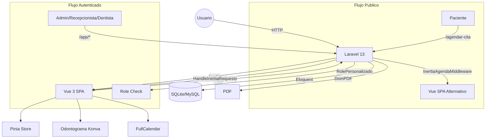

# Codentalv3

Sistema de gestion para clinica dental construido con Laravel 13 + Inertia (Vue 3 + TypeScript). Administra pacientes, citas, odontogramas, presupuestos, facturacion y expediente clinico en una interfaz SPA con roles diferenciados (administrador, recepcionista, dentista).

## Tabla de Contenidos

- [Acerca del Proyecto](#acerca-del-proyecto)
- [Arquitectura y Tecnologias](#arquitectura-y-tecnologias)
- [Inicio Rapido](#inicio-rapido)
- [Comandos Principales](#comandos-principales)
- [Roles del Sistema](#roles-del-sistema)
- [Referencia de Rutas](#referencia-de-rutas)
- [Estructura del Proyecto](#estructura-del-proyecto)
- [Variables de Entorno](#variables-de-entorno)
- [Pruebas](#pruebas)
- [Contribucion](#contribucion)

## Acerca del Proyecto

Codentalv3 digitaliza los procesos operativos de una clinica dental: agenda de citas, historia clinica, odontograma interactivo (diagrama dental basado en Konva), presupuestos con desglose por tratamiento, control de abonos, generacion de PDF (recetas, evoluciones, presupuestos) y modulo de facturacion con restriccion de acceso financiero.

### Funcionalidades Principales

- **Agenda de citas** con calendario (FullCalendar), confirmacion y cancelacion
- **Flujo publico de agendado** para pacientes sin autenticacion (identificacion, registro, seleccion de horario, confirmacion con PDF)
- **Expediente clinico**: historia clinica con antecedentes medicos, odontologicos y habitos
- **Odontograma interactivo**: diagrama dental con hallazgos por diente, cara dental y enfermedad, con seguimiento temporal (evaluacion inicial, seguimiento, alta, reevaluacion)
- **Presupuestos**: catalogo de tratamientos, precios con descuentos, estado por detalle
- **Facturacion y caja**: registro de abonos, distribucion por detalle de presupuesto, anulaciones, estado de cuenta por paciente
- **Evolucion clinica y recetas**: registro por cita, descarga PDF
- **Control de usuarios**: CRUD de usuarios del sistema con roles (admin, recepcionista, dentista)
- **PDF generation** via DomPDF para confirmacion de citas, recetas, evoluciones y presupuestos

## Arquitectura y Tecnologias

### Stack

| Capa | Tecnologia |
|------|-----------|
| Backend | Laravel 13 (PHP 8.3+) |
| Frontend | Vue 3 + TypeScript + Inertia.js v3 |
| UI Framework | Tailwind CSS v4 + daisyUI v5 |
| State | Pinia |
| Calendar | FullCalendar v7 |
| Odontograma | Konva.js + vue-konva |
| Routing (client) | Ziggy (Type-safe Laravel routes en JS) |
| PDF | DomPDF (barryvdh/laravel-dompdf) |
| Database | SQLite (default), MySQL compatible via config |
| Build | Vite 8 + laravel-vite-plugin + @inertiajs/vite |
| Testing | PHPUnit 12 + SQLite :memory: |

### Diagrama de Arquitectura



### Decisiones Tecnicas

- **Inertia.js v3** como glue layer entre Laravel y Vue 3, sin API REST separada. Las rutas se definen exclusivamente en `routes/web.php` y se consumen via Ziggy desde el frontend.
- **Dos entrypoints de Vite**: `resources/js/app.ts` (SPA principal con Pinia, toast, Konva) y `resources/js/main.ts` (para flujo publico no-Inertia). Configurados en `vite.config.ts` como inputs del plugin Laravel.
- **Dos layouts de Inertia**: `app-inertia` (autenticado, con sidebar y header) y `agendar-cita-inertia` (flujo publico), intercambiados via middleware `HandleInertiaRequests` e `InertiaAgendaMiddleware`.
- **El dominio del negocio esta en espanol**: modelos (Paciente, Cita, Odontograma, Presupuesto), rutas, controladores y migraciones usan nomenclatura en espanol consistente.

## Inicio Rapido

### Prerrequisitos

- PHP 8.3+
- Composer 2.x
- Node.js 22+ y npm
- SQLite (extension `pdo_sqlite` habilitada en PHP)

### Instalacion

```bash
composer run setup
```

Este comando ejecuta en secuencia:

1. `composer install` -- dependencias PHP
2. Copia `.env.example` a `.env` si no existe
3. `php artisan key:generate` -- genera APP_KEY
4. `php artisan migrate --force` -- ejecuta migraciones en SQLite
5. `npm install --ignore-scripts` -- dependencias JS
6. `npm run build` -- compila assets de Vite

### Iniciar Servidores de Desarrollo

```bash
composer run dev
```

Ejecuta concurrentemente `php artisan serve` y `npm run dev` (Vite HMR). La aplicacion queda disponible en `http://localhost:8000`.

El servidor de Vite corre en `http://localhost:5173` y hace hot-reload del frontend.

## Comandos Principales

| Comando | Descripcion |
|---------|-------------|
| `composer run setup` | Instalacion completa (dependencias, migraciones, build) |
| `composer run dev` | Servidores de desarrollo concurrentes (PHP + Vite) |
| `composer test` | Ejecuta toda la suite de pruebas PHPUnit |
| `php artisan test --filter=NombreTest` | Ejecuta una prueba especifica |
| `php artisan migrate` | Ejecuta migraciones pendientes |
| `php artisan db:seed` | Ejecuta seeders (DienteSeeder, CarasDentalesSeeder, EnfermedadSeeder, etc.) |
| `npm run build` | Compila assets para produccion |
| `php artisan ziggy:generate` | Regenera definiciones TypeScript de rutas |

## Roles del Sistema

Tres roles definidos en `UserRolEnum`:

| Role | Clave | Acceso |
|------|-------|--------|
| Administrador | `admin` | Acceso completo: usuarios, configuracion, finanzas, pacientes |
| Recepcionista | `recep` | Dashboard de recepcion, agenda, pacientes, facturacion (solo lectura financiera) |
| Dentista | `dent` | Agenda personal, evolucion clinica, odontograma, recetas. Sin acceso a facturacion ni administracion de usuarios |

El middleware `role.personalizado` (`RolePersonalizado.php`) valida el acceso en las rutas protegidas. El middleware `CheckFinancialAccess` restringe escritura en modulo de caja para dentistas.

## Referencia de Rutas

### Publicas (sin autenticacion)

| Metodo | URI | Nombre |
|--------|-----|--------|
| GET | `/` | `index` |
| GET/POST | `/login` | `login.show` / `login` |
| GET | `/logout` | `logout` |
| GET | `/agendar-cita` | `agendar-cita` |
| GET/POST | `/agendar-cita/identificar-paciente` | `agendar-cita.identificar-paciente` |
| GET/POST | `/agendar-cita/registrar-paciente` | `agendar-cita.paciente-nuevo.show` / `agendar-cita.registrar-paciente` |
| GET/POST | `/agendar-cita/calendario` | `agendar-cita.calendario.show` / `agendar-cita.calendario.store` |
| GET | `/agendar-cita/confirmacion/{cita}` | `agendar-cita.confirmacion` |
| GET | `/agendar-cita/confirmacion/{cita}/pdf` | `agendar-cita.descargar-pdf` |

### Autenticadas (prefix `/app`)

#### Agenda
| Metodo | URI | Nombre |
|--------|-----|--------|
| GET | `/app/agenda` | `agenda` |
| POST | `/app/agenda/citas` | `agenda.citas.store` |
| GET/PATCH | `/app/agenda/cita/{cita}/confirmar` | `agenda.citas.confirmar` |
| PATCH | `/app/agenda/cita/{cita}/cancelar` | `agenda.citas.cancelar` |

#### Evolucion Clinica y Recetas
| Metodo | URI | Nombre |
|--------|-----|--------|
| GET/POST | `/app/citas/{cita}/evolucion` | `evolucion.create` / `evolucion.store` |
| GET | `/app/evoluciones/{evolucion}/pdf` | `evolucion.pdf` |
| GET | `/app/recetas/{receta}/pdf/download` | `recetas.pdf.download` |
| GET | `/app/recetas/{receta}/pdf/stream` | `recetas.pdf.stream` |

#### Dashboard Recepcion (admin + recep)
| Metodo | URI | Nombre |
|--------|-----|--------|
| GET | `/app/recepcion/dashboard` | `recepcion.dashboard` |

#### Pacientes
| Metodo | URI | Nombre |
|--------|-----|--------|
| GET | `/app/pacientes` | `pacientes.index` |
| GET/POST | `/app/pacientes/create` | `pacientes.create` / `pacientes.store` |
| GET/PATCH | `/app/pacientes/edit/{paciente}` | `pacientes.edit` / `pacientes.update` |
| DELETE | `/app/pacientes/delete/{paciente}` | `pacientes.destroy` |
| GET | `/app/pacientes/show/{paciente}` | `pacientes.show` |
| POST | `/app/pacientes/verify/{paciente}` | `pacientes.verify` |
| GET/PATCH | `/app/pacientes/{paciente}/historia-clinica` | `pacientes.historia-clinica.edit` / `update` |
| POST | `/app/pacientes/{paciente}/consulta-express` | `pacientes.consulta-express` |

#### Odontograma
| Metodo | URI | Nombre |
|--------|-----|--------|
| GET | `/app/pacientes/{paciente}/odontograma/inicial` | `pacientes.odontograma.inicial` |
| GET | `/app/pacientes/{paciente}/odontograma/final` | `pacientes.odontograma.final` |
| POST | `/app/pacientes/{paciente}/odontograma` | `pacientes.odontograma.guardar` |

#### Caja / Facturacion (con CheckFinancialAccess)
| Metodo | URI | Nombre |
|--------|-----|--------|
| GET | `/app/caja/facturacion` | `caja.facturacion` |
| GET | `/app/caja/facturacion/buscar-pacientes` | `caja.facturacion.buscar-pacientes` |
| POST | `/app/caja/facturacion/abonos` | `caja.abonos.store` |
| POST | `/app/caja/facturacion/abonos/{movimiento}/anular` | `caja.abonos.anular` |
| GET | `/app/caja/facturacion/estado-cuenta/{pacienteId}` | `caja.estado-cuenta` |

#### Presupuestos
| Metodo | URI | Nombre |
|--------|-----|--------|
| GET | `/app/presupuestos/{presupuesto}/pdf` | `presupuestos.pdf.download` |

#### Administracion (solo admin)
| Metodo | URI | Nombre |
|--------|-----|--------|
| GET | `/app/admin/usuarios` | `usuarios` |
| GET/POST | `/app/admin/usuarios/create` | `usuarios.create` / `usuarios.store` |
| GET/PATCH | `/app/admin/usuarios/edit/{user}` | `usuarios.edit` / `usuarios.update` |
| DELETE | `/app/admin/usuarios/delete/{user}` | `usuarios.destroy` |
| GET | `/app/admin/profile/{user}` | `usuarios.profile` |
| GET/PATCH | `/app/admin/settings/{user}` | `usuarios.settings` |

## Estructura del Proyecto

```
resources/
  js/
    app.ts                    # Entrypoint Inertia (Pinia, Ziggy, Konva, Toast)
    main.ts                   # Entrypoint secundario (flujo publico)
    bootstrap.ts              # Configuracion Axios
    ziggy.d.ts                # Tipos generados de Ziggy
    Pages/                    # Componentes Inertia (12 paginas)
      Agenda/Calendario.vue
      Agenda/ConfirmarCita.vue
      AgendarCita/            # Flujo publico
      Doctor/EvolutionForm.vue
      Facturacion/Index.vue
      Pacientes/Create.vue
      Pacientes/HistoriaClinica/Edit.vue
      Pacientes/Odontograma/Inicial.vue
      Pacientes/Odontograma/Final.vue
      Reception/Dashboard.vue
    components/               # Componentes reutilizables
      AgendarCita/RegistrarPacienteWizard/  # Wizard 5 pasos
      Odontograma/            # Diente.vue, OdontogramaSVG.vue, etc.
      Pacientes/RegistrarPacienteExpedienteWizard/
    stores/                   # Pinia stores
      odontograma.ts
      registrarPacienteWizard.ts
    composables/              # Composables reutilizables
    types/                    # Interfaces TypeScript
  views/
    layouts/
      app-inertia.blade.php   # Layout autenticado (drawer + sidebar + header)
      agendar-cita-inertia.blade.php  # Layout publico
    pdf/                      # Templates PDF (DomPDF)
    app/pacientes/            # Legacy Blade views (en transicion a Inertia)
    agendar-cita/             # Legacy Blade views (flujo publico mixto)

app/
  Http/
    Controllers/              # 18 controladores
    Middleware/
      AuthPersonalizado.php   # Autenticacion personalizada
      RolePersonalizado.php   # Control de roles
      CheckFinancialAccess.php # Restriccion modulo financiero
      HandleInertiaRequests.php # Shared props Inertia
      InertiaAgendaMiddleware.php  # Layout alternativo flujo publico
  Models/                     # 22 modelos (Paciente, Cita, Odontograma, etc.)
  Enums/                      # EstatusCitaEnum, UserRolEnum, SexoEnum, etc.
  Casts/TelephoneCast.php     # Normaliza telefonos a 10 digitos

routes/
  web.php                     # Todas las rutas de la aplicacion

database/
  migrations/                 # 26 migraciones
  seeders/                    # 5 seeders (Dientes, Caras, Enfermedades, etc.)
```

## Variables de Entorno

Las variables principales se definen en `.env`. El archivo `.env.example` contiene la configuracion base:

| Variable | Default | Descripcion |
|----------|---------|-------------|
| `APP_NAME` | `Laravel` | Nombre de la aplicacion |
| `APP_ENV` | `local` | Entorno (`local`, `production`, `testing`) |
| `APP_DEBUG` | `true` | Modo debug |
| `APP_URL` | `http://localhost` | URL base |
| `DB_CONNECTION` | `sqlite` | Driver de BD (`sqlite`, `mysql`) |
| `SESSION_DRIVER` | `database` | Driver de sesion |
| `QUEUE_CONNECTION` | `database` | Driver de cola |
| `CACHE_STORE` | `database` | Driver de cache |

Para usar MySQL, descomentar las variables `DB_HOST`, `DB_PORT`, `DB_DATABASE`, `DB_USERNAME`, `DB_PASSWORD` en `.env` y cambiar `DB_CONNECTION=mysql`.

## Pruebas

La suite de pruebas usa SQLite en memoria (`:memory:`) con drivers forzados a `array`/`sync` para sesion, cache y cola (configurado en `phpunit.xml`). No requiere base de datos externa.

```bash
composer test
```

Equivalente a `php artisan config:clear && php artisan test`. No ejecutar `phpunit` directamente porque omitiria el paso de `config:clear`.

Para ejecutar una prueba especifica:

```bash
php artisan test --filter=HistoriaClinicaAntecedentesMedicosTest
php artisan test tests/Feature/ExampleTest.php
```

## Fragmentos de Codigo por Modulo

### Modelos (Eloquent ORM)

#### Cita -- Casts a enum, relaciones BelongsTo/HasOne

```php
class Cita extends Model
{
    use HasFactory;

    protected $table = 'citas';
    protected $guarded = [];

    public function paciente(): BelongsTo
    {
        return $this->belongsTo(Paciente::class, 'paciente_id');
    }

    public function dentista(): BelongsTo
    {
        return $this->belongsTo(User::class, 'dentista_id');
    }

    public function evolucionClinica()
    {
        return $this->hasOne(EvolucionClinica::class, 'cita_id');
    }

    protected function casts(): array
    {
        return [
            'fecha_inicio' => 'datetime',
            'fecha_fin' => 'datetime',
            'estatus' => EstatusCitaEnum::class,
        ];
    }
}
```

#### Paciente -- Cast personalizado (TelephoneCast), HasManyThrough, Global Scope

```php
class Paciente extends Model
{
    use HasFactory;

    protected $table = 'pacientes';
    protected $guarded = [];

    public function citas(): HasMany
    {
        return $this->hasMany(Cita::class, 'paciente_id');
    }

    public function historiaClinica(): HasOne
    {
        return $this->hasOne(HistoriaClinica::class, 'paciente_id');
    }

    public function recetas(): HasManyThrough
    {
        return $this->hasManyThrough(Receta::class, Cita::class, 'paciente_id', 'cita_id');
    }

    public function scopeNeedsFollowUp($query)
    {
        return $query->whereHas('citas', function ($q) {
            $q->where('estatus', EstatusCitaEnum::FINALIZADO->value)
              ->where('fecha_inicio', '<', now()->subMonths(6));
        })->orWhere(function ($q) {
            $q->whereDoesntHave('citas', function ($q2) {
                $q2->where('fecha_inicio', '>=', now());
            });
        });
    }

    protected function casts(): array
    {
        return [
            'telefono' => TelephoneCast::class,
            'sexo' => SexoEnum::class,
            'fecha_nacimiento' => 'date',
        ];
    }
}
```

#### Odontograma -- Relacion HasMany con Hallazgos, Enum casting

```php
class Odontograma extends Model
{
    use HasFactory;

    protected $table = 'odontogramas';
    protected $guarded = [];

    public function paciente(): BelongsTo
    {
        return $this->belongsTo(Paciente::class, 'paciente_id');
    }

    public function hallazgos(): HasMany
    {
        return $this->hasMany(HallazgoDental::class, 'odontograma_id');
    }

    protected function casts(): array
    {
        return [
            'tipo_seguimiento' => TipoSeguimientoOdontogramaEnum::class,
            'fecha' => 'date',
        ];
    }
}
```

### Enums (PHP 8 Backed Enums)

```php
enum UserRolEnum: string
{
    case DENTISTA = 'dent';
    case RECEPCIONISTA = 'recep';
    case ADMINISTRADOR = 'admin';
}

enum EstatusCitaEnum: string
{
    case PENDIENTE = 'Pendiente';
    case CONFIRMADA = 'Confirmada';
    case CANCELADA = 'Cancelada';
    case REPROGRAMADA = 'Reprogramada';
    case FINALIZADO = 'Finalizado';
}
```

### Migraciones (Schema Blueprint)

```php
// create_pacientes_table.php
Schema::create('pacientes', function (Blueprint $table) {
    $table->id();
    $table->string('nombre');
    $table->string('apellido_paterno');
    $table->string('apellido_materno')->nullable();
    $table->string('telefono')->unique();
    $table->date('fecha_nacimiento');
    $table->enum('sexo', ['M', 'F', 'O']);
    $table->string('direccion')->nullable();
    $table->string('estado')->nullable();
    $table->string('municipio')->nullable();
    $table->string('ocupacion')->nullable();
    $table->string('estado_civil')->nullable();
    $table->string('correo_electronico')->nullable();
    $table->string('religion')->nullable();
    $table->boolean('verificado')->default(false);
    $table->timestamps();
});

// create_citas_table.php
Schema::create('citas', function (Blueprint $table) {
    $table->id();
    $table->foreignId('paciente_id')->constrained('pacientes')->cascadeOnDelete();
    $table->foreignId('dentista_id')->constrained('users')->cascadeOnDelete();
    $table->foreignId('creado_por_id')->nullable()->constrained('users')->nullOnDelete();
    $table->datetime('fecha_inicio');
    $table->datetime('fecha_fin');
    $table->string('estatus', 20)->default(EstatusCitaEnum::PENDIENTE->value);
    $table->timestamps();
});
```

### Controladores (Inertia + Request Validation)

#### AgendaController -- CRUD de citas con filtro por rol y validacion de horarios

```php
class AgendaController extends Controller
{
    public function index(Request $request)
    {
        $usuario = auth()->user();
        $rolUsuario = $usuario->rol->value;

        $citasQuery = Cita::with('dentista')
            ->where('fecha_inicio', '>=', Carbon::now()->startOfWeek(Carbon::MONDAY));

        // Los dentistas solo ven sus propias citas
        if ($rolUsuario === UserRolEnum::DENTISTA->value) {
            $citasQuery->where('dentista_id', $usuario->id);
        }

        $citas = $citasQuery->with(['dentista', 'paciente'])
            ->orderBy('fecha_inicio')
            ->get()
            ->map(function (Cita $cita) {
                return [
                    'id' => $cita->id,
                    'estatus' => $cita->estatus->value,
                    'title' => trim("{$cita->paciente?->nombre} {$cita->paciente?->apellido_paterno}"),
                    'start' => $cita->fecha_inicio->toIso8601String(),
                    'end' => $cita->fecha_fin->toIso8601String(),
                    'backgroundColor' => $cita->estatus === EstatusCitaEnum::PENDIENTE ? '#f59e0b' : '#22c55e',
                    'extendedProps' => [
                        'dentista_nombre' => trim("{$cita->dentista?->nombre} {$cita->dentista?->apellido_paterno}"),
                        'confirmacion_url' => route('agenda.citas.confirmar', ['cita' => $cita->id]),
                    ],
                ];
            });

        return Inertia::render('Agenda/Calendario', [
            'rolUsuario' => $rolUsuario,
            'citas' => $citas,
            'doctores' => $doctores,
            'pacientes' => $pacientes,
        ]);
    }

    public function store(Request $request)
    {
        $validated = $request->validate([
            'paciente_id' => ['required', 'exists:pacientes,id'],
            'dentista_id' => ['required', 'exists:users,id'],
            'fecha_inicio' => ['required', 'date', 'after:now'],
            'fecha_fin' => ['required', 'date', 'after:fecha_inicio'],
            'motivo' => ['nullable', 'string', 'max:500'],
        ]);

        // Validar cruce de horarios
        $cruce = Cita::where('dentista_id', $validated['dentista_id'])
            ->where(function ($query) use ($inicio, $fin) {
                $query->where('fecha_inicio', '<', $fin)
                    ->where('fecha_fin', '>', $inicio);
            })->exists();

        $cita = Cita::create([...$validated, 'estatus' => EstatusCitaEnum::PENDIENTE->value]);

        return redirect()->route('agenda.citas.confirmar', ['cita' => $cita->id]);
    }
}
```

#### OdontogramaController -- Renderizado y guardado de odontograma con firstOrCreate

```php
class OdontogramaController extends Controller
{
    public function inicial(Paciente $paciente): Response
    {
        return $this->renderOdontograma($paciente, 'inicial');
    }

    private function renderOdontograma(Paciente $paciente, string $vista): Response
    {
        $odontogramaInicial = Odontograma::with(['hallazgos.enfermedad', 'hallazgos.diente', 'hallazgos.caraDental'])
            ->where('paciente_id', $paciente->id)
            ->where('tipo_seguimiento', TipoSeguimientoOdontogramaEnum::EVALUACION_INICIAL)
            ->first();

        return Inertia::render('Pacientes/Odontograma/' . ucfirst($vista), [
            'paciente' => [
                'id' => $paciente->id,
                'nombre' => $paciente->nombre,
                'apellido_paterno' => $paciente->apellido_paterno,
            ],
            'catalogoEnfermedades' => Enfermedad::orderBy('nombre')->get(),
            'catalogoCaras' => CarasDentales::all()->map(fn ($c) => [
                'id' => $c->id, 'nombre' => $c->nombre, 'codigo' => $c->codigo,
            ]),
            'dientes' => Diente::orderBy('numero_fdi')->get(),
            'inicial' => $this->mapOdontograma($odontogramaInicial),
            'final' => $this->mapOdontograma($odontogramaFinal),
        ]);
    }

    public function guardar(Request $request, Paciente $paciente)
    {
        $vista = $request->input('vista');
        $tipo = $vista === 'inicial'
            ? TipoSeguimientoOdontogramaEnum::EVALUACION_INICIAL
            : TipoSeguimientoOdontogramaEnum::SEGUIMIENTO;

        DB::transaction(function () use ($request, $paciente, $tipo) {
            $odontograma = Odontograma::firstOrCreate(
                ['paciente_id' => $paciente->id, 'tipo_seguimiento' => $tipo],
                ['odontologo_id' => auth()->id(), 'fecha' => Carbon::today()]
            );

            $odontograma->hallazgos()->delete();

            foreach ($request->input('hallazgos') as $item) {
                HallazgoDental::create([
                    'odontograma_id' => $odontograma->id,
                    'diente_id' => Diente::where('numero_fdi', $item['diente'])->first()->id,
                    'cara_dental_id' => $item['cara'] === 'C' ? null : $carasPorCodigo->get($item['cara'])?->id,
                    'enfermedad_id' => $item['enfermedad_id'],
                    'estado' => strtolower($item['estado']),
                    'en_plan' => $item['en_plan'] ?? false,
                ]);
            }
        });

        return redirect()->route("pacientes.odontograma.{$vista}", $paciente);
    }
}
```

#### PacienteController -- Transaccion para crear Paciente + HistoriaClinica

```php
class PacienteController extends Controller
{
    function store(Request $request)
    {
        $validated = $request->validate([
            'nombre' => 'required|string|max:255',
            'apellido_paterno' => 'required|string|max:255',
            'telefono' => 'required|string|max:10|unique:pacientes,telefono',
            'fecha_nacimiento' => 'required|date',
            'sexo' => 'required|in:M,F,O',
            'enfermedades_previas' => 'nullable|array',
            'habitos_toxicos' => 'nullable|array',
        ]);

        DB::transaction(function () use ($validated) {
            $paciente = Paciente::create([...]);
            HistoriaClinica::create([
                'paciente_id' => $paciente->id,
                'enfermedades_previas' => array_values($validated['enfermedades_previas'] ?? []),
                'habitos_toxicos' => [
                    'tabaco' => (bool) ($validated['habitos_toxicos']['tabaco'] ?? false),
                    'alcohol' => (bool) ($validated['habitos_toxicos']['alcohol'] ?? false),
                ],
            ]);
        });

        return Inertia::location(route('pacientes.index'));
    }
}
```

### Middleware

#### RolePersonalizado -- Control de acceso por roles con splat params

```php
class RolePersonalizado
{
    public function handle(Request $request, Closure $next, string ...$roles): Response
    {
        $user = $request->user();

        if (! $user) {
            abort(401, 'No autenticado');
        }

        $rolUsuario = $user->rol instanceof UserRolEnum
            ? $user->rol->value
            : (string) $user->rol;

        if ($roles !== [] && ! in_array($rolUsuario, $roles, true)) {
            abort(403, 'No tienes permisos para acceder a esta ruta.');
        }

        return $next($request);
    }
}
```

#### CheckFinancialAccess -- Restriccion por metodo HTTP y ruta

```php
class CheckFinancialAccess
{
    public function handle(Request $request, Closure $next): Response
    {
        $user = $request->user();

        // Bloquear escritura a dentistas en rutas financieras
        if (in_array($request->getMethod(), ['POST', 'PUT', 'PATCH', 'DELETE'])
            && $user->rol === UserRolEnum::DENTISTA->value) {
            abort(403, 'Los medicos no tienen permisos para modificar registros financieros.');
        }

        // Solo admin puede anular pagos
        if ($request->routeIs('*.anular') && $user->rol !== UserRolEnum::ADMINISTRADOR->value) {
            abort(403, 'Solo un Administrador puede anular pagos.');
        }

        return $next($request);
    }
}
```

### Vistas Vue 3 (Inertia Pages)

#### Agenda/Calendario.vue -- Integracion FullCalendar con tipos TypeScript

```vue
<script setup lang="ts">
import { computed, ref } from 'vue'
import { Head, router, useForm } from '@inertiajs/vue3'
import { route } from 'ziggy-js'

import FullCalendar from '@fullcalendar/vue3'
import dayGridPlugin from '@fullcalendar/vue3/daygrid'
import timeGridPlugin from '@fullcalendar/vue3/timegrid'
import interactionPlugin from '@fullcalendar/vue3/interaction'
import esLocale from '@fullcalendar/vue3/locales/es'

type CitaEvento = {
  id: number
  estatus?: string
  title: string
  start: string
  end: string
  backgroundColor: string
  extendedProps: {
    dentista_id: number
    dentista_nombre?: string
    paciente_nombre?: string
    confirmacion_url?: string
  }
}

const props = defineProps<{
  rolUsuario: string
  usuarioId: number
  citas: CitaEvento[]
  doctores: { id: number; nombre: string; apellido_paterno: string }[]
  pacientes: { id: number; nombre: string; apellido_paterno: string; telefono: string }[]
}>()

const form = useForm({
  paciente_id: '',
  dentista_id: '',
  fecha_inicio: '',
  fecha_fin: '',
  motivo: '',
})

function handleDateSelect(selectInfo: DateSelectArg) {
  form.fecha_inicio = selectInfo.startStr
  form.fecha_fin = selectInfo.endStr
  ;(document.getElementById('cita_modal') as HTMLDialogElement).showModal()
}

function handleEventClick(clickInfo: EventClickArg) {
  const url = clickInfo.event.extendedProps.confirmacion_url
  if (url) router.visit(url)
}

function guardarCita() {
  form.post(route('agenda.citas.store'), {
    onSuccess: () => form.reset(),
  })
}
</script>

<template>
  <Head title="Agenda" />
  <FullCalendar :options="calendarOptions" />
  <!-- Dialog para crear cita -->
  <dialog id="cita_modal" class="modal">
    <div class="modal-box">
      <h2 class="text-lg font-bold mb-4">Nueva Cita</h2>
      <select v-model="form.paciente_id" class="select select-bordered w-full mb-2">
        <option value="">Seleccionar paciente</option>
        <option v-for="p in pacientes" :key="p.id" :value="p.id">
          {{ p.nombre }} {{ p.apellido_paterno }}
        </option>
      </select>
      <button class="btn btn-primary w-full" @click="guardarCita" :disabled="form.processing">
        Guardar Cita
      </button>
    </div>
    <form method="dialog" class="modal-backdrop"><button>cerrar</button></form>
  </dialog>
</template>
```

#### Pacientes/Odontograma/Inicial.vue -- Odontograma dibujado con Konva

```vue
<script setup lang="ts">
import { onMounted } from 'vue'
import { useOdontogramaStore } from '@/stores/odontograma'
import CatalogoEnfermedades from '@/components/Odontograma/CatalogoEnfermedades.vue'
import ModalAfeccion from '@/components/Odontograma/ModalAfeccion.vue'
import OdontogramaSVG from '@/components/Odontograma/OdontogramaSVG.vue'
import OdontogramaTabla from '@/components/Odontograma/OdontogramaTabla.vue'
import type { CaraDental } from '@/types/Odontograma'

const props = defineProps<{
  paciente: { id: number; nombre: string; apellido_paterno: string }
  catalogoEnfermedades: any[]
  catalogoCaras: any[]
  dientes: any[]
  inicial: any | null
  final: any | null
}>()

const store = useOdontogramaStore()

onMounted(() => {
  store.catalogoEnfermedades = props.catalogoEnfermedades
  store.catalogoCaras = props.catalogoCaras
  if (props.inicial) {
    store.hallazgosInicial = props.inicial.hallazgos
    store.observacionesInicial = props.inicial.observaciones ?? ''
  }
})

function onSeleccionarDiente(diente: number, cara: CaraDental) {
  store.dienteSeleccionado = diente
  store.caraSeleccionada = cara
  store.mostrarModal = true
}
</script>

<template>
  <div class="flex gap-6">
    <div class="flex-1">
      <OdontogramaSVG tipo="inicial" @seleccionar="onSeleccionarDiente" />
      <OdontogramaTabla tipo="inicial" />
    </div>
    <aside class="w-72">
      <CatalogoEnfermedades />
    </aside>
  </div>
  <ModalAfeccion tipo="inicial" />
</template>
```

#### Facturacion/Index.vue -- Registro de abonos con distribucion

```vue
<script setup lang="ts">
import { computed, ref, watch } from 'vue'
import { router, useForm } from '@inertiajs/vue3'
import { route } from 'ziggy-js'

const props = defineProps<{
  rol: string | null
  puedeRegistrar: boolean
  pacientes: any[]
  saldo: number
  total_cargos: number
  total_abonos: number
  tratamientos: any[]
  movimientos: any[]
}>()

const pagoForm = useForm({
  paciente_id: '',
  monto: '',
  metodo_pago: 'efectivo',
  referencia_bancaria: '',
  distribucion: [{ presupuesto_detalle_id: '', monto_aplicado: '' }],
})

function registrarAbono() {
  pagoForm.post(route('caja.abonos.store'), {
    preserveScroll: true,
    onSuccess: () => pagoForm.reset(),
  })
}

const saldoRestante = computed(() => props.total_cargos - props.total_abonos)
</script>

<template>
  <div class="grid grid-cols-1 lg:grid-cols-3 gap-6">
    <section class="lg:col-span-2">
      <table class="table table-zebra">
        <thead>
          <tr>
            <th>Fecha</th>
            <th>Concepto</th>
            <th>Monto</th>
          </tr>
        </thead>
        <tbody>
          <tr v-for="m in movimientos" :key="m.id">
            <td>{{ m.fecha_hora }}</td>
            <td>{{ m.tipo_movimiento }}</td>
            <td>${{ Number(m.monto).toFixed(2) }}</td>
          </tr>
        </tbody>
      </table>
    </section>

    <aside class="card bg-base-200 p-4">
      <h2 class="font-bold text-lg mb-4">Registrar Abono</h2>
      <input v-model="pagoForm.monto" type="number" placeholder="Monto" class="input input-bordered w-full mb-2" />
      <select v-model="pagoForm.metodo_pago" class="select select-bordered w-full mb-2">
        <option value="efectivo">Efectivo</option>
        <option value="transferencia">Transferencia</option>
        <option value="tarjeta">Tarjeta</option>
      </select>
      <button class="btn btn-primary w-full" @click="registrarAbono" :disabled="pagoForm.processing">
        Registrar Abono
      </button>
      <div class="divider"></div>
      <p>Saldo: <strong>${{ saldoRestante.toFixed(2) }}</strong></p>
    </aside>
  </div>
</template>
```

### Componente Reutilizable (Odontograma/Diente.vue -- Konva SVG)

```vue
<script setup lang="ts">
import { useOdontogramaStore } from '@/stores/odontograma'
import type { CaraDental } from '@/types/Odontograma'

const props = defineProps<{
    numero: number
    tipo: 'inicial' | 'final'
}>()

const emit = defineEmits<{
    (e: 'seleccionar', diente: number, cara: CaraDental): void
}>()

const store = useOdontogramaStore()

function colorCara(cara: CaraDental): string {
    return store.getColorCara(props.tipo, props.numero, cara)
}
</script>

<template>
    <g class="diente">
        <text :x="26" y="6" text-anchor="middle" class="text-[8px] fill-current select-none">
            {{ numero }}
        </text>
        <path d="M 10,12 Q 26,8 42,12 Q 46,32 42,52 Q 26,56 10,52 Q 6,32 10,12 Z"
              fill="none" stroke="currentColor" stroke-width="1.5" />
        <path d="M 10,12 Q 26,8 42,12 L 36,24 L 16,24 Z"
              class="cara cursor-pointer" :fill="colorCara('O')"
              stroke="currentColor" stroke-width="0.75"
              @click="emit('seleccionar', props.numero, 'O')" />
        <path d="M 16,24 L 36,24 L 36,40 L 16,40 Z"
              class="cara cursor-pointer" :fill="colorCara('V')"
              stroke="currentColor" stroke-width="0.75"
              @click="emit('seleccionar', props.numero, 'V')" />
    </g>
</template>
```

### Pinia Store (Estado del Odontograma)

```typescript
import { defineStore } from 'pinia'
import { computed, ref } from 'vue'
import type { CaraDental, Enfermedad, Hallazgo, TipoVista } from '@/types/Odontograma'

export const useOdontogramaStore = defineStore('odontograma', () => {
    const catalogoEnfermedades = ref<Enfermedad[]>([])
    const hallazgosInicial = ref<Hallazgo[]>([])
    const hallazgosFinal = ref<Hallazgo[]>([])

    const enfermedadesPorId = computed(() => {
        const mapa = new Map<number, Enfermedad>()
        for (const enfermedad of catalogoEnfermedades.value) {
            mapa.set(enfermedad.id, enfermedad)
        }
        return mapa
    })

    function getColorCara(tipo: TipoVista, diente: number, cara: CaraDental): string {
        const hallazgo = getHallazgo(tipo, diente, cara)
        if (!hallazgo) return cara === 'C' ? 'transparent' : '#FFFFFF'
        if (tipo === 'final' && hallazgo.estado === 'RESUELTO') return 'transparent'
        return enfermedadesPorId.value.get(hallazgo.enfermedad_id)?.color ?? '#FFFFFF'
    }

    function agregarHallazgo(tipo: TipoVista, diente: number, cara: CaraDental,
                              enfermedadId: number, notas = ''): void {
        const lista = tipo === 'inicial' ? hallazgosInicial.value : hallazgosFinal.value
        const index = lista.findIndex(h => h.diente === diente && h.cara === cara)
        const hallazgo: Hallazgo = {
            diente, cara, enfermedad_id: enfermedadId, notas,
            estado: 'ACTIVO', en_plan: false,
        }
        if (index >= 0) lista[index] = hallazgo
        else lista.push(hallazgo)
    }

    return { catalogoEnfermedades, hallazgosInicial, hallazgosFinal,
             enfermedadesPorId, getColorCara, agregarHallazgo }
})
```

### PDF Blade (Presupuesto via DomPDF)

```blade
@extends('layouts.pdf')

@section('document-content')
    <div class="title">Presupuesto</div>

    <table class="table">
        <tr>
            <th>Folio</th>
            <td>#{{ str_pad($presupuesto->id, 6, '0', STR_PAD_LEFT) }}</td>
            <th>Emision</th>
            <td>{{ $presupuesto->fecha_emision?->format('d/m/Y') }}</td>
        </tr>
        <tr>
            <th>Paciente</th>
            <td colspan="3">{{ $presupuesto->paciente?->nombre }} {{ $presupuesto->paciente?->apellido_paterno }}</td>
        </tr>
        <tr>
            <th>Dentista</th>
            <td colspan="3">Dr(a). {{ $presupuesto->dentista?->nombre }} {{ $presupuesto->dentista?->apellido_paterno }}</td>
        </tr>
    </table>

    <table class="table">
        <thead>
            <tr>
                <th>Tratamiento</th>
                <th>Precio</th>
                <th>Descuento</th>
                <th>Total</th>
            </tr>
        </thead>
        <tbody>
            @foreach ($presupuesto->detalles as $detalle)
                <tr>
                    <td>{{ $detalle->tratamientoCatalogo?->nombre ?? 'Tratamiento' }}</td>
                    <td>${{ number_format((float) $detalle->precio_congelado, 2) }}</td>
                    <td>${{ number_format((float) $detalle->monto_descuento, 2) }}</td>
                    <td>${{ number_format((float) $detalle->precio_congelado - (float) $detalle->monto_descuento, 2) }}</td>
                </tr>
            @endforeach
        </tbody>
    </table>
@endsection
```

### Tipos TypeScript (Odontograma types)

```typescript
// resources/js/types/Odontograma.ts
export type CaraDental = 'V' | 'L' | 'M' | 'D' | 'O' | 'C'

export type EstadoHallazgo = 'ACTIVO' | 'RESUELTO' | 'DESCARTADO'

export type Hallazgo = {
    id?: number
    diente: number
    cara: CaraDental
    enfermedad_id: number
    notas: string
    estado: EstadoHallazgo
    en_plan: boolean
}

export type TipoVista = 'inicial' | 'final'

export type Enfermedad = {
    id: number
    nombre: string
    color: string
}
```

## Contribucion

### Convenciones de Codigo

- Indentacion: 4 espacios, final de linea LF, salto de linea final requerido (`.editorconfig`)
- Nomenclatura del dominio en espanol (modelos, controladores, rutas, migraciones)
- Comentarios: minimos o nulos en codigo nuevo
- TypeScript strict mode habilitado en `tsconfig.json`
- Las rutas nuevas se definen en `routes/web.php` con namespacing consistente

### Flujo de Trabajo

1. Crear rama a partir de `main`
2. Implementar cambios (backend + frontend en el mismo commit cuando esten acoplados por Inertia)
3. Ejecutar `composer test` para validar
4. Si se agregaron/modificaron rutas, regenerar tipos Ziggy: `php artisan ziggy:generate`
5. Abrir Pull Request

### Notas para Desarrollo

- No resucitar codigo comentado en `routes/web.php` -- el bloque legacy (lineas 128-176) se conserva como referencia historica unicamente
- Para agregar una nueva pagina Inertia: crear el archivo `.vue` en `resources/js/Pages/`, agregar la ruta en `routes/web.php` con el controlador correspondiente, y regenerar tipos Ziggy
- El layout de Inertia se selecciona via middleware: `HandleInertiaRequests` para el app autenticado, `InertiaAgendaMiddleware` para el flujo publico
- Los componentes Vue usan la ruta `@/` como alias de `resources/js/` (configurado en `tsconfig.json`)
